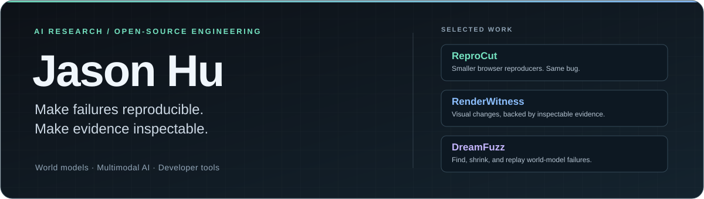

<div align="center">
  
</div>

<p align="center">
  <strong>I turn hard-to-pin-down AI failures into tests, counterexamples, and replayable evidence.</strong><br />
  <sub>把难以描述的模型失败，变成可测试、可复现、可审查的工程证据。</sub>
</p>

<p align="center">
  <a href="https://realjasonhu.github.io/dreamfuzz/"></a>
  <a href="https://github.com/RealJasonHu/renderwitness"></a>
  <a href="https://github.com/RealJasonHu?tab=repositories"></a>
</p>

## Selected work / 代表成果

Two original open-source tools—each shipped with a release, automated tests, documentation, and a reproducible demo path.

<table>
  <tr>
    <td width="50%" valign="top">
      <a href="https://github.com/RealJasonHu/dreamfuzz">
        
      </a>
      <h3><a href="https://github.com/RealJasonHu/dreamfuzz">DreamFuzz</a></h3>
      <p><strong>Property-based testing for world models.</strong></p>
      <p>Instead of reporting only average rollout error, DreamFuzz searches for the shortest valid action sequence that makes a model's imagination meaningfully wrong.</p>
      <ul>
        <li>Searches adversarial action sequences under a fixed budget</li>
        <li>Shrinks failures into compact regression cases</li>
        <li>Exports deterministic JSON + self-contained HTML replays</li>
        <li>Runs its core with zero third-party runtime dependencies</li>
      </ul>
      <p>
        <a href="https://realjasonhu.github.io/dreamfuzz/"></a>
        <a href="https://github.com/RealJasonHu/dreamfuzz/releases/tag/v0.1.0"></a>
        <a href="https://github.com/RealJasonHu/dreamfuzz/actions/workflows/ci.yml"></a>
      </p>
    </td>
    <td width="50%" valign="top">
      <a href="https://github.com/RealJasonHu/renderwitness">
        
      </a>
      <h3><a href="https://github.com/RealJasonHu/renderwitness">RenderWitness</a></h3>
      <p><strong>Evidence-first VLM review for visual regressions.</strong></p>
      <p>RenderWitness combines deterministic pixel evidence with structured VLM judgment, so every semantic claim can be traced back to the exact changed region.</p>
      <ul>
        <li>Detects and numbers changed regions deterministically</li>
        <li>Validates model findings against strict schemas</li>
        <li>Supports local VLMs through Ollama-compatible endpoints</li>
        <li>Produces portable HTML + JSON evidence reports</li>
      </ul>
      <p>
        <a href="https://github.com/RealJasonHu/renderwitness"></a>
        <a href="https://github.com/RealJasonHu/renderwitness/releases/tag/v0.1.0"></a>
        <a href="https://github.com/RealJasonHu/renderwitness/actions/workflows/ci.yml"></a>
      </p>
    </td>
  </tr>
</table>

## Open-source contributions / 上游贡献

I also work directly in established codebases, from AI gateways and robotics tooling to physics simulation.

| Project | Contribution | Proof |
| --- | --- | --- |
| **LiteLLM** | Preserved caller-provided spend metadata on authentication failures, with safe parsing and focused regression coverage for malformed and missing-header cases. | [BerriAI/litellm#38493](https://github.com/BerriAI/litellm/pull/38493) |
| **Podman Desktop** | Fixed a navigation resize handle leaking above the full-screen welcome overlay and added a Playwright hit-test regression. | [podman-desktop#18998](https://github.com/podman-desktop/podman-desktop/pull/18998) |
| **MuJoCo** | Reproduced seven friction-creep cases and clarified the modeling and performance tradeoffs of `impratio` and the NoSlip solver. | [google-deepmind/mujoco#3526](https://github.com/google-deepmind/mujoco/pull/3526) |
| **LeRobot** | Reviewed the intermediate-prediction contract for world-model policies and identified periodic-eval propagation and non-image output failure paths. | [huggingface/lerobot#3757](https://github.com/huggingface/lerobot/pull/3757#pullrequestreview-5040741407) |

## What the work demonstrates / 成果能力图谱

| | Capability | Evidence in the projects |
| --- | --- | --- |
| **01** | **Research problem framing** | Turns vague model failures into falsifiable properties, bounded searches, and reviewable counterexamples. |
| **02** | **AI systems engineering** | Separates deterministic evidence from probabilistic model judgment instead of hiding both behind one score. |
| **03** | **Developer-tool delivery** | Ships CLIs, typed contracts, test suites, CI, versioned releases, bilingual docs, and portable reports. |
| **04** | **Reproducibility by design** | Records seeds, inputs, model/provider identity, structured outputs, and the artifacts needed to replay a result. |

## Build principles / 工程取向

```text
counterexamples > averages
replayable artifacts > screenshots of success
deterministic evidence + explicit uncertainty > opaque AI judgment
small, inspectable systems > feature piles
```

## Toolbox / 工具箱

<p>
  
  
  
  
  
</p>

<p align="center">
  <sub>World models · Visual AI · Robotics · Testing infrastructure · Open source</sub>
</p>
